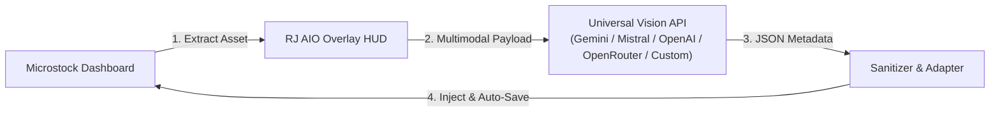

# RJ AIO Metadata Extension


> **Universal AI-Powered Metadata Generator & Automated Draft Saver for Microstock Contributors**  
> Built for Chromium browsers (Google Chrome, Microsoft Edge, Brave) using Chrome Manifest V3.

---

## Overview Workflow



---

## Key Features

- **Universal Vision Engine**: Provider-agnostic client supporting any OpenAI-compatible multimodal endpoint with 5 native presets: **Google Gemini**, **Mistral AI**, **OpenAI**, **OpenRouter**, and **Custom Endpoints** (custom base URLs).
- **Dual-Mode Precision UI**:
  - *Toolbar Popup*: API provider setup, model selector, keyword quotas, and platform configurations with real-time auto-save.
  - *In-Page Overlay HUD*: Draggable, minimizable floating HUD with live asset counters, batch progress, and graceful stop controls directly on contributor dashboards.
- **7 Microstock Platforms Supported**:
  - **Adobe Stock**: React Spectrum inputs, 21 category IDs, AI declaration, and bulk save.
  - **Shutterstock**: Shared Photo/Video taxonomies, spelling warning auto-approval, and bulk save.
  - **Dreamstime**: 15 Main / 182 Subcategories taxonomy tree and cross-page continuation.
  - **Vecteezy**: Auto filetype categories, AI custom model inputs, and prohibited terms handling.
  - **Freepik (Magnific)**: 47 base models catalog, AI prompt injection, and per-item draft save loop.
  - **Depositphotos**: Virtualized itemeditor scoping, 160 items/page, and fast tag paste.
  - **MiriCanvas**: 1,000 items/page batch grid, ContentTier, and reactive per-chip removal.
- **100% Multi-Language Resilience**: Driven purely by structural DOM attributes (`data-testid`, `value`, `name`, `:nth-of-type`, SVG signatures). Operates seamlessly across non-English dashboard interfaces (Indonesian, Korean, Japanese, German, French, etc.).
- **Exclusive Automation Concurrency Lock**: Browser-wide single-runner lock preventing multiple tabs from triggering conflicting batch runs simultaneously.
- **Raycast Dark Precision Design**: Pure dark aesthetic (`#07080a`), emerald teal accents, and clean Lucide SVG iconography with a strict Zero Native Emoji policy.

---

## Installation & Getting Started

### Option A: End-User Installation (Recommended)

1. Download the latest release archive (`v0.1.2.zip`) from [GitHub Releases](https://github.com/riiicil/rj-aio-metadata/releases).
2. Extract the ZIP file on your computer.
3. Open your Chromium browser (Chrome / Edge / Brave) and navigate to `chrome://extensions/`.
4. Enable **Developer mode** toggle in the top right corner.
5. Click **Load unpacked** (*Muat yang belum dibongkar*).
6. Select the **`LOAD THIS FOLDER`** directory inside the extracted folder.
7. Click the extension icon in your browser toolbar, enter your Vision API key, and you are ready to automate!

### Option B: Developer Installation (From Source)

1. Clone this repository:
   ```bash
   git clone https://github.com/riiicil/rj-aio-metadata.git
   ```
2. In `chrome://extensions/`, click **Load unpacked** and select the **`src/`** folder:
   ```
   path/to/rj-aio-metadata/src
   ```

---

## Support & Donation

If this extension saves you hours of manual metadata entry and helps your microstock workflow, consider supporting its continued development:

[](https://s.id/rjsupport)

Every contribution helps maintain platform adapters as microstock portals update their frontend interfaces!

---

## Give a Star

If you find this project useful, please consider giving it a star on GitHub! It helps more microstock contributors discover the tool.

---

## Documentation

- [`AGENTS.md`](./AGENTS.md) — Mandatory AI agent governance & instructions
- [`CHANGELOG.md`](./CHANGELOG.md) — Release history and detailed version notes
- [`DESIGN.md`](./DESIGN.md) — Raycast Dark Precision Design System & Icon Policy
- [`docs/DOCS_STYLE.md`](./docs/DOCS_STYLE.md) — Documentation standards & boilerplate templates
- [`docs/ARCHITECTURE.md`](./docs/ARCHITECTURE.md) — Technical architecture & Mermaid diagrams
- [`docs/CURRENT_STATE.md`](./docs/CURRENT_STATE.md) — Real-time project status & adapter matrix
- [`docs/DECISIONS.md`](./docs/DECISIONS.md) — Architectural Decision Records (ADRs)
- [`docs/GIT_POLICY.md`](./docs/GIT_POLICY.md) — Branching, SemVer versioning & Conventional Commits
- [`docs/HANDOFF.md`](./docs/HANDOFF.md) — Developer onboarding & platform gotchas guide
- [`docs/ROADMAP.md`](./docs/ROADMAP.md) — Phase-by-phase execution milestones
- [`docs/references/`](./docs/references/) — Technical DOM reverse-engineering analysis files

---

## License

MIT License © 2026 [Riiicil](https://github.com/riiicil).
