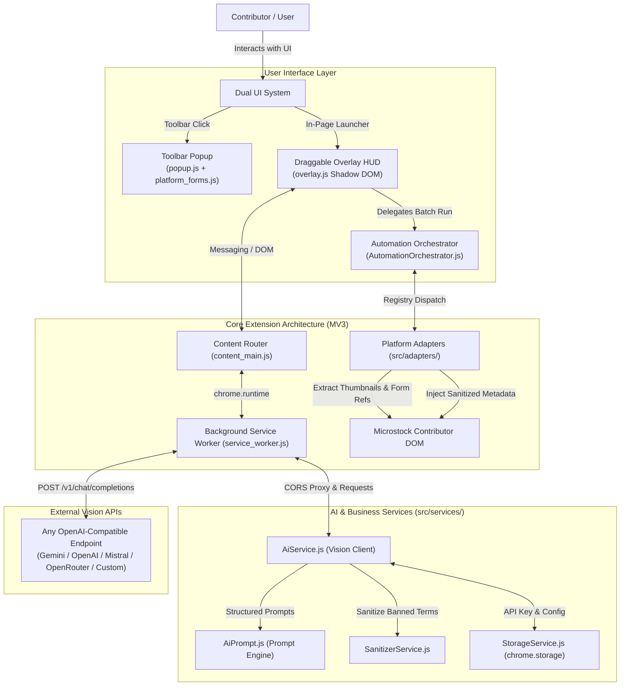
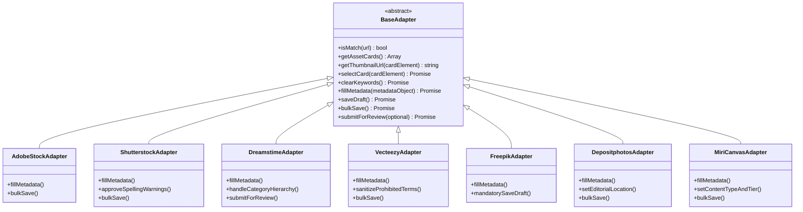

# Architecture — RJ AIO Metadata Extension

## 1. System Overview

**RJ AIO Metadata** is a Chromium browser extension (Manifest V3) designed to streamline and automate metadata generation for microstock contributors. It bridges local browser contributor dashboards with multimodal Vision LLMs using a **Universal OpenAI-Compatible API protocol**.



---

## 2. Tech Stack

| Layer | Technology | Purpose & Notes |
| :--- | :--- | :--- |
| **Platform Standard** | Chrome Manifest V3 (MV3) | Modern browser extension standard for Chromium browsers |
| **Runtime & Modules** | Vanilla JavaScript (ES6 Modules) | Zero bundler bloat in dev mode, native browser execution |
| **Production Bundler** | `esbuild` + `javascript-obfuscator` | Bundle-first pipeline resolving ESM imports, deep AST obfuscation |
| **Design System** | Raycast Dark Precision (`DESIGN.md`) | Dark canvas `#07080a`, emerald teal `#079183`, zero native emoji |
| **Iconography** | Phosphor Icons / Lucide SVG | Clean inline SVG components (16px / 20px) |
| **Storage** | `chrome.storage.local` & `sync` | API keys, active provider presets, prompt templates, auto-save |
| **Background** | Service Worker (`service_worker.js`)| API proxy bypassing CORS, auto-heal tab watcher, active tab routing |
| **Overlay UI** | Custom Draggable In-Page HUD | Open-mode Shadow DOM (`#rj-overlay-host`), draggable, minimizable |
| **AI Protocol** | Universal OpenAI-Compatible API | Custom `baseUrl`, `apiKey`, and multimodal `modelId` |

---

## 3. Core Subsystems

### A. Universal OpenAI-Compatible Vision Engine (`src/services/AiService.js` & `AiPrompt.js`)
Instead of hardcoding specific AI vendors, the extension implements a universal client compliant with the standard OpenAI chat completions endpoint:

```
POST {baseUrl}/chat/completions
Authorization: Bearer {apiKey}
Content-Type: application/json

{
  "model": "{modelId}",
  "messages": [
    {
      "role": "system",
      "content": "You are a professional microstock metadata specialist..."
    },
    {
      "role": "user",
      "content": [
        { "type": "text", "text": "{structuredPrompt}" },
        { "type": "image_url", "image_url": { "url": "data:image/jpeg;base64,{base64Image}" } }
      ]
    }
  ],
  "temperature": 0.3,
  "response_format": { "type": "json_object" }
}
```

- **Supported Endpoints (5 Presets)**:
  - Google Gemini (`https://generativelanguage.googleapis.com/v1beta/openai/`)
  - Mistral AI (`https://api.mistral.ai/v1`)
  - OpenAI (`https://api.openai.com/v1`)
  - OpenRouter (`https://openrouter.ai/api/v1`)
  - Custom Endpoints (User-specified custom OpenAI-compatible base URL)


---

### B. Unified Platform Adapter Registry (`src/adapters/`)
Every microstock platform implements a standardized `BaseAdapter` interface:



---

### C. Dual-Mode UI Architecture & Orchestration

1. **Toolbar Popup (`src/popup/`)**:
   - Primary hub for global configuration: API Provider credentials, custom Base URLs, default language, prompt templates, and active platform detector.
   - Modular Dynamic Form Generators (`src/popup/platform_forms.js`): Pure HTML generator modules for all 7 platforms, isolating layout from event handling.
   - Real-Time Auto-Save Engine: Text inputs debounced (300ms), steppers and toggles immediate, bidirectional storage synchronization.
   - Dynamic Support & Progress Ticker (`#btnSupportProgress`): Alternates between live progress (`[Spinner] X/Y (Z%)`) and 5 rotating donation variants with zero native emoji.
2. **In-Page Draggable Overlay HUD (`src/overlay/`)**:
   - Injected via an isolated open-mode Shadow DOM (`#rj-overlay-host`) linking `overlay.css`, guaranteeing 100% immune from host page styling bleed.
   - Draggable header with viewport clamping and persistent coordinate memory (`chrome.storage.local`).
   - Minimizable floating pill with dynamic status icons (layers, ready, rotating spinner).
3. **Decoupled Batch Automation Orchestrator (`src/overlay/AutomationOrchestrator.js`)**:
   - Extracted from `OverlayHUD` to separate UI presentation from execution mechanics.
   - Manages batch iterations across grid platforms (Section 6B) and carousel loops (Section 6A Dreamstime).
   - Handles two-stage graceful stop coordination (`stop(force)`), post-loop `bulkSave()`, and abort signals.
4. **Exclusive Single-Runner Automation Concurrency Lock**:
   - Enforces a browser-wide single-runner lock (`activeAutomationTabId`).
   - When one platform tab is active, all other platform HUDs and the toolbar popup lock their Start buttons with a `Running on [Platform]` badge, lock SVG icon, and informative tooltips.

---

## 4. Supported Platforms & Technical References

All platform DOM mappings are backed by deep reverse-engineering records in [`docs/references/`](file:///c:/Users/admin/Desktop/git/RJ_AIO_Metadata/docs/references):

| Platform | Hostname Pattern | Technical Reference File | Key Platform Nuance |
| :--- | :--- | :--- | :--- |
| **Adobe Stock** | `contributor.stock.adobe.com` | [`analysis_adobestock.md`](file:///c:/Users/admin/Desktop/git/RJ_AIO_Metadata/docs/references/analysis_adobestock.md) | React Spectrum controlled inputs, 21 categories, scrollbar centering |
| **Shutterstock** | `submit.shutterstock.com` | [`analysis_shutterstock.md`](file:///c:/Users/admin/Desktop/git/RJ_AIO_Metadata/docs/references/analysis_shutterstock.md) | Material-UI testids, Image vs Video categories, spelling warnings auto-approval |
| **Dreamstime** | `dreamstime.com/uploadfile` | [`analysis_dreamstime.md`](file:///c:/Users/admin/Desktop/git/RJ_AIO_Metadata/docs/references/analysis_dreamstime.md) | 15 Main / 182 Subcategories taxonomy tree, cross-page navigation continuation |
| **Vecteezy** | `contributors.vecteezy.com` | [`analysis_vecteezy.md`](file:///c:/Users/admin/Desktop/git/RJ_AIO_Metadata/docs/references/analysis_vecteezy.md) | Right-panel scoping, prohibited terms filter, AI "Other" custom input |
| **Freepik** | `contributor.freepik.com` / `magnific.com` | [`analysis_freepik.md`](file:///c:/Users/admin/Desktop/git/RJ_AIO_Metadata/docs/references/analysis_freepik.md) | Mandatory Save Draft per item before navigation, 47 AI base models |
| **Depositphotos** | `depositphotos.com/files/unfinished`| [`analysis_depositphotos.md`](file:///c:/Users/admin/Desktop/git/RJ_AIO_Metadata/docs/references/analysis_depositphotos.md) | 160 items/page, scoped itemeditor queries, fast raw tag paste |
| **MiriCanvas** | `designhub.miricanvas.com` | [`analysis_miricanvas.md`](file:///c:/Users/admin/Desktop/git/RJ_AIO_Metadata/docs/references/analysis_miricanvas.md) | 1,000 items/page batching, ContentTier, reactive verified per-chip removal |
| **Universal API** | Custom Base URLs | [`analysis_api.md`](file:///c:/Users/admin/Desktop/git/RJ_AIO_Metadata/docs/references/analysis_api.md) | Universal OpenAI-compatible multimodal chat completions |

---

## 5. Security, Storage & Production Packaging Model

1. **Local-First Storage**: API keys and prompt templates are stored strictly in `chrome.storage.sync` / `chrome.storage.local`. Credentials never leave the user's browser except in direct calls to the user-specified API endpoint.
2. **CORS Mitigation**: Background service worker acts as a secure request dispatcher when direct web page `fetch()` is blocked by CORS policies.
3. **No External Tracking**: Zero third-party telemetry, tracking pixels, or intermediate servers.
4. **Multi-Tab Isolation & Auto-Heal**: `rj_automation_state` is partitioned by `platformId` and `tabId`. Background service worker automatically heals stuck states if a runner tab is closed or navigated away.
5. **Bundle-First Production Packaging Pipeline**:
   - `esbuild` bundles the 4 MV3 entry points into standalone self-contained scripts.
   - `javascript-obfuscator` obfuscates bundled scripts with base64 string encryption while preserving developer console logs (`disableConsoleOutput: false`).
   - Packaged into `dist/LOAD THIS FOLDER/` and zipped to `releases/v[version].zip` for end-user distribution.

