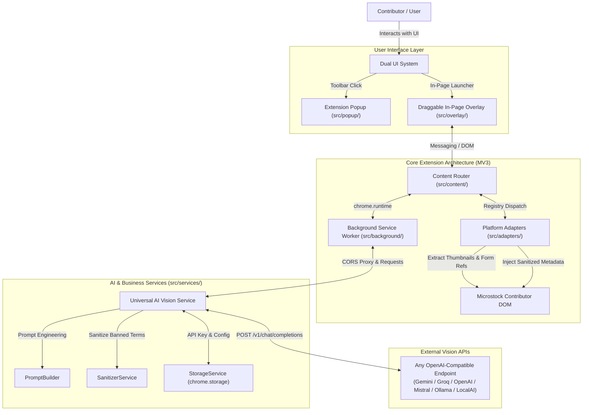
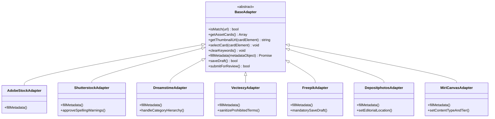

# Architecture — RJ AIO Metadata Extension

## 1. System Overview

**RJ AIO Metadata** is a Chromium browser extension (Manifest V3) designed to streamline and automate metadata generation for microstock contributors. It bridges local browser dashboards with multimodal Vision LLMs using a **Universal OpenAI-Compatible API protocol**.



---

## 2. Tech Stack

| Layer | Technology | Purpose & Notes |
| :--- | :--- | :--- |
| **Platform Standard** | Chrome Manifest V3 (MV3) | Modern browser extension standard for Chromium |
| **Runtime & Modules** | Vanilla JavaScript (ES6 Modules) | Zero bundler bloat, native browser execution |
| **Design System** | Raycast Dark Precision (`DESIGN.md`) | Dark canvas `#07080a`, glassmorphism, no native emoji |
| **Iconography** | Phosphor Icons / Lucide SVG | Clean inline/packaged SVG icons (16px / 20px) |
| **Storage** | `chrome.storage.sync` & `local` | API keys, active provider presets, prompt templates |
| **Background** | Web Worker / `service_worker.js` | API proxy to bypass CORS, badge management, tab sync |
| **Overlay UI** | Custom Draggable In-Page HUD | Draggable header, minimizable pill, batch controls |
| **AI Protocol** | Universal OpenAI-Compatible API | Custom `baseUrl`, `apiKey`, and multimodal `modelId` |

---

## 3. Core Subsystems

### A. Universal OpenAI-Compatible Vision Engine (`src/services/AiVisionService.js`)
Instead of hardcoding specific AI vendors, the extension implements a universal client compliant with the standard OpenAI chat completions endpoint:

```
POST {baseUrl}/chat/completions
Authorization: Bearer {apiKey}
Content-Type: application/json

{
  "model": "{modelId}",
  "messages": [
    {
      "role": "system",
      "content": "You are a professional microstock metadata specialist..."
    },
    {
      "role": "user",
      "content": [
        { "type": "text", "text": "{structuredPrompt}" },
        { "type": "image_url", "image_url": { "url": "data:image/jpeg;base64,{base64Image}" } }
      ]
    }
  ],
  "temperature": 0.3,
  "response_format": { "type": "json_object" }
}
```

- **Supported Endpoints**:
  - Google Gemini (`https://generativelanguage.googleapis.com/v1beta/openai/`)
  - Groq Vision (`https://api.groq.com/openai/v1`)
  - Mistral AI (`https://api.mistral.ai/v1`)
  - OpenAI (`https://api.openai.com/v1`)
  - OpenRouter (`https://openrouter.ai/api/v1`)
  - Local/Self-hosted (`http://localhost:11434/v1`, vLLM, LocalAI)

---

### B. Unified Platform Adapter Registry (`src/adapters/`)
Every microstock platform implements a standardized `BaseAdapter` interface:



---

### C. Dual-Mode UI Architecture

1. **Toolbar Popup (`src/popup/`)**:
   - Primary hub for global configuration: API Provider credentials, custom Base URLs, default language, prompt templates, and active platform detector.
2. **In-Page Draggable Overlay HUD (`src/overlay/`)**:
   - Injected into the active contributor page via content scripts.
   - Draggable header allowing contributors to reposition it anywhere on screen.
   - Minimize toggle (`─`) shrinking the HUD to a compact badge.
   - Batch progress indicators, single-click "Auto-Tag All", and preview/edit metadata drawers.

---

## 4. Supported Platforms & Technical References

All platform DOM mappings are backed by deep reverse-engineering records in [`docs/references/`](file:///c:/Users/admin/Desktop/git/RJ_AIO_Metadata/docs/references):

| Platform | Hostname Pattern | Technical Reference File | Key Platform Nuance |
| :--- | :--- | :--- | :--- |
| **Adobe Stock** | `contributor.stock.adobe.com` | [`analysis_adobestock.md`](file:///c:/Users/admin/Desktop/git/RJ_AIO_Metadata/docs/references/analysis_adobestock.md) | React Spectrum controlled inputs, 21 categories |
| **Shutterstock** | `submit.shutterstock.com` | [`analysis_shutterstock.md`](file:///c:/Users/admin/Desktop/git/RJ_AIO_Metadata/docs/references/analysis_shutterstock.md) | Material-UI testids, Image vs Video categories, spelling warnings auto-approval |
| **Dreamstime** | `dreamstime.com/uploadfile` | [`analysis_dreamstime.md`](file:///c:/Users/admin/Desktop/git/RJ_AIO_Metadata/docs/references/analysis_dreamstime.md) | 15 Main / 182 Subcategories taxonomy tree, clear buttons |
| **Vecteezy** | `contributors.vecteezy.com` | [`analysis_vecteezy.md`](file:///c:/Users/admin/Desktop/git/RJ_AIO_Metadata/docs/references/analysis_vecteezy.md) | Automatic filetype categories, prohibited terms filter, AI "Other" custom input |
| **Freepik** | `contributor.freepik.com` | [`analysis_freepik.md`](file:///c:/Users/admin/Desktop/git/RJ_AIO_Metadata/docs/references/analysis_freepik.md) | Mandatory Save Draft per item before navigation, AI base models list |
| **Depositphotos** | `depositphotos.com/files/unfinished`| [`analysis_depositphotos.md`](file:///c:/Users/admin/Desktop/git/RJ_AIO_Metadata/docs/references/analysis_depositphotos.md) | 160 items/page paginator, raw tag paste trigger, editorial country/city AJAX |
| **MiriCanvas** | `designhub.miricanvas.com` | [`analysis_miricanvas.md`](file:///c:/Users/admin/Desktop/git/RJ_AIO_Metadata/docs/references/analysis_miricanvas.md) | 1,000 items/page batching, ContentType (BITMAP/PICTURE/SVG) & Tier (Free/Pro) |
| **Universal API** | Custom Base URLs | [`analysis_api.md`](file:///c:/Users/admin/Desktop/git/RJ_AIO_Metadata/docs/references/analysis_api.md) | Universal OpenAI-compatible multimodal chat completions |

---

## 5. Security & Storage Model

1. **Local-First Storage**: API keys and prompt templates are stored strictly in `chrome.storage.sync` / `chrome.storage.local`. Credentials never leave the user's browser except in direct calls to the user-specified API endpoint.
2. **CORS Mitigation**: Background service worker acts as a secure request dispatcher when direct web page `fetch()` is blocked by CORS policies.
3. **No External Tracking**: Zero third-party telemetry, tracking pixels, or intermediate servers.
