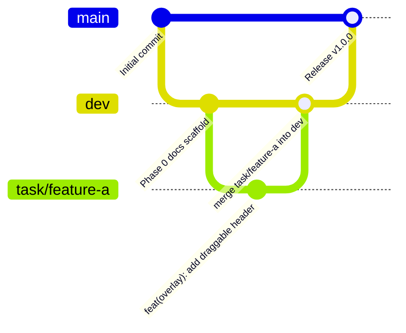

# Git Policy — RJ AIO Metadata Extension

## 1. Branch Model



- **`main`**: Production & stable releases only. Never commit directly to `main`.
- **`dev`**: Integration branch. Always stable and loadable as an unpacked extension.
- **`task/*`**: Working branches branched from `dev`. All feature work and refactors occur in `task/*` branches.

---

## 2. Branch Naming Conventions

Format: `task/<kebab-case-description>`

- Short and descriptive
- All lowercase, words separated by hyphens
- **No phase number prefixes**

| Valid Examples | Invalid Examples |
| :--- | :--- |
| `task/governance-docs` | `task/phase0-governance-docs` (no phase prefixes) |
| `task/draggable-overlay-ui` | `task/phase2-overlay` (no phase prefixes) |
| `task/universal-vision-service`| `task/Phase3-Vision` (all lowercase, no phase) |
| `task/freepik-adapter-fix` | `feature/freepik-fix` (use `task/` prefix) |

---

## 3. Conventional Commit Format

Commit message format: `<type>(<scope>): <description>`

- **Subject line**: Max 72 characters, imperative mood ("add", "fix", "refactor" — not "added", "fixing").
- **Types**:
  - `feat`: New feature or user-facing capability.
  - `fix`: Bug fix or DOM selector correction.
  - `refactor`: Code change that neither fixes a bug nor adds a feature.
  - `docs`: Documentation updates only.
  - `style`: Code style / CSS styling adjustments.
  - `chore`: Repository configuration, `.gitignore`, or scaffolding.
  - `test`: Adding or modifying tests.

### Examples:
```
chore(repo): initialize git and configure .gitignore
docs(governance): add complete documentation suite and DOCS_STYLE.md
feat(overlay): implement draggable and minimizable in-page HUD
feat(services): implement universal OpenAI-compatible vision client
fix(adapters): update Vecteezy prohibited terms auto-sanitizer
style(popup): apply Raycast dark precision tokens
```

---

## 4. Merge Policy

- Always use non-fast-forward merge: `git merge --no-ff`.
- Merge commit format: `merge branch 'task/<name>' into dev`.
- Delete local task branches after successful integration into `dev`.

---

## 5. Prohibited Files & Safety Rules

Never stage or commit:
- `.env` and `.env.*`
- `bahan/`, `dev-tools/`, `scratch/`
- `*.log`
- `node_modules/` or `dist/`
- Unpackaged private keys (`*.key`, `*.pem`)

---

## 6. Release & Versioning Policy

The project strictly follows **Semantic Versioning 2.0.0 (SemVer)**:

$$\mathbf{vX.Y.Z} \quad (\text{MAJOR}.\text{MINOR}.\text{PATCH})$$

### A. Version Increment Rules
- **MAJOR (`X.0.0`)**: Incompatible API changes, major architectural redesigns, or breaking storage migrations (e.g., manifest standard upgrades, radical configuration format redesign).
- **MINOR (`0.X.0`)**: Backwards-compatible new features (e.g., adding a new platform adapter, integrating a new AI vision provider, new UI panels).
- **PATCH (`0.0.X`)**: Backwards-compatible bug fixes, DOM selector adjustments for microstock portal updates, performance optimizations, or documentation fixes.

### B. Version Synchronization
Whenever a release is prepared, the version number **must be strictly synchronized across three files**:
1. `src/manifest.json`: `"version": "X.Y.Z"` (Chromium Manifest V3 standard requires pure integer dot notation without the 'v' prefix).
2. `package.json`: `"version": "X.Y.Z"`.
3. `CHANGELOG.md`: `## [X.Y.Z] - YYYY-MM-DD`.

### C. Release Tagging & Merge Sequence
1. Ensure all tests pass and documentation is synchronized on the working branch.
2. Run `node build.js` to create production artifacts in `dist/LOAD THIS FOLDER/` and `releases/vX.Y.Z.zip`.
3. Merge the feature/hardening branch into `dev` using non-fast-forward:
   ```bash
   git checkout dev
   git merge --no-ff task/<branch-name> -m "merge branch 'task/<branch-name>' into dev"
   ```
4. Merge `dev` into `main` for the official release:
   ```bash
   git checkout main
   git merge --no-ff dev -m "chore(release): vX.Y.Z"
   ```
5. Create an annotated Git tag matching the version:
   ```bash
   git tag -a vX.Y.Z -m "Release vX.Y.Z"
   ```
6. Push branches and tags to the remote repository only upon explicit user instruction:
   ```bash
   git push origin main dev --tags
   ```

