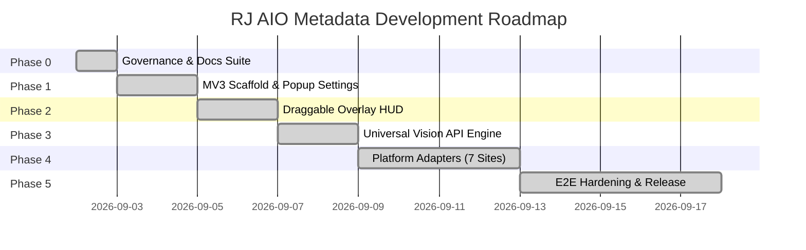

# Project Roadmap — RJ AIO Metadata Extension

---

## Milestone Overview



---

## Phase Breakdown

### Phase 0: Project Governance, Documentation Suite & Scaffolding `[COMPLETE]`
- [x] Reverse-engineer and document 7 microstock platforms in `docs/references/`.
- [x] Create root governance files: `AGENTS.md`, `DESIGN.md` (Raycast Design System), `README.md`, `CHANGELOG.md`.
- [x] Create complete documentation suite: `docs/DOCS_STYLE.md`, `docs/ARCHITECTURE.md`, `docs/CURRENT_STATE.md`, `docs/DECISIONS.md`, `docs/GIT_POLICY.md`, `docs/HANDOFF.md`, `docs/ROADMAP.md`.
- [x] Initialize Git repository with `main`, `dev`, and `task/phase0-governance-docs` branches.
- [x] Scaffold Manifest V3 source directory structure in `src/`.

---

### Phase 1: Manifest V3 Scaffold, Storage Service & Popup Settings UI `[COMPLETE]`
- [x] Implement `src/manifest.json` with permissions (`storage`, `activeTab`, `scripting`), universal content script matches, and icons (`src/icons/`).
- [x] Implement `src/services/StorageService.js` for API keys, custom `baseUrl`, model presets, keyword prioritization, schema versioning (v3), and `.txt` file reader.
- [x] Implement `src/background/service_worker.js` with dynamic model fetcher (`/v1/models`), Google Gemini query auth, active tab routing, and overlay toggle relay.
- [x] Build Platform-Adaptive Toolbar Popup UI (`src/popup/popup.html`, `popup.css`, `popup.js`, `src/styles/components.css`):
  - Active platform selector with real-time match indicator (Green check vs Red mismatch + navigation helper link).
  - API provider configuration (Gemini, Mistral, OpenAI, OpenRouter, Custom) + API Key password toggle & `.txt` file import.

  - Model dropdown + dynamic model fetching with refresh rotation animation and active model selection guard.
  - Universal settings: Keyword count stepper with platform limit boundaries + Specific custom keywords (index 0 priority).
  - 100% modular platform-dynamic settings for Adobe Stock, Shutterstock, Dreamstime, Vecteezy, Freepik, Depositphotos (with 237 countries catalog), MiriCanvas.
  - Processing safety: automatic field locking during active automation.
  - Interactive toolbar header with in-place HUD toggle button featuring cyan hairline outline active state.
  - Top-right 3-item FIFO stacked toast notification system with 2-line text clamping, manual close button, and smooth slide-out reflow.

---

### Phase 2: In-Page Draggable Floating Overlay HUD (Raycast Design System) `[COMPLETE]`
- [x] Build Draggable & Minimizable In-Page HUD (`src/overlay/overlay.js`, `overlay.css`, `src/content/content_main.js`):
  - Isolated Shadow DOM host (`#rj-overlay-host` open mode) linking scoped stylesheet `overlay.css` ensuring zero host CSS bleed.
  - Fluid drag-and-drop header handler with strict viewport boundary clamping and coordinates persistence in `chrome.storage.local`.
  - Dual-mode display: 270px Expanded HUD Card and 32px Minimized Floating Pill with spring transition animations (`cubic-bezier(0.16, 1, 0.3, 1)`).
  - Adaptive Quick Form:
    - Target keyword stepper with platform limit clamping (Adobe: 49, Dreamstime: 70, MiriCanvas: 25, others: 50).
    - Specific keywords input (Index 0 priority) with debounced storage persistence.
    - Platform-adaptive AI / Generative Declaration toggle (automatically hidden on Shutterstock & Depositphotos).
  - Live Multi-Platform Asset Counter & Progress Track:
    - Periodic (2.5s) and `MutationObserver` reactive DOM asset querying across all 7 platforms.
    - Depositphotos subtab media category detection (`Images`, `Vectors`, `PNG`, `Videos`, `Audio`).
    - Shutterstock subtab media category detection (`Images` vs `Videos` with accurate button count parsing).
    - Dreamstime single-asset ID edit mode detection (`In ID 473814624`).
  - Context-Aware Status Icons on Minimized Pill:
    - Layers icon (`.rj-status-icon-layers`) when assets are detected (`35 Assets`, `ID: 473814624`).
    - Checkmark icon (`.rj-status-icon-ready`) when verified on supported microstock page with 0 assets.
    - Alert warning icon (`#f59e0b`) on unsupported pages.
  - Non-microstock tab safety: Warning banner ("Not a supported microstock page"), "Unknown Page" header tag, and "Assets Not Detected" label with automation disabled.
  - Primary Automation Action Button (Start/Stop) styled in deep emerald teal (`#079183`) / danger red (`#ff6161`) with model selection guard.
  - Bidirectional real-time state synchronization via `chrome.storage.onChanged` between in-page HUD and popup UI.

---

### Phase 3: Universal OpenAI-Compatible Vision AI Service & Prompt Engine `[COMPLETE]`
- [x] Implement `src/services/AiPrompt.js`:
  - Platform-adaptive prompt engineering optimized for microstock SEO (commercial relevance, flat 80-keyword quota, 1-2 words/tag, non-English language routing for Adobe Stock).
  - Official platform category taxonomies (Adobe Stock 21 IDs, Shutterstock 26 Image / 19 Video, Dreamstime 15 Main & Subcategories).
  - Dynamic output schemas with character safety margins (Adobe/Vecteezy title <=185, Freepik/MiriCanvas title <=90, descriptions <=230; Vecteezy description strictly omitted).
  - Multimodal OpenAI `buildChatPayload` with model-safe parameter guards (omits `temperature` for strict models like GPT-5, o1, o3).
- [x] Implement `src/services/SanitizerService.js`:
  - Resilient JSON extraction and repair (`extractAndParseJson`) from markdown fences (```json) and conversational text, with trailing comma repair.
  - Microstock keyword pipeline (`sanitizeKeywords`): word count <=2, symbol stripping, Vecteezy/general prohibited terms filtering, user custom keywords index-0 priority, case-insensitive deduplication, and platform quota clamping.
  - Smart boundary clamping (`sanitizeTitle`, `sanitizeDescription`): sentence boundary cut, word boundary cut without mid-word cuts, mandatory trailing period.
  - Shutterstock editorial prefix normalization (`: `, double-prefix prevention) and unified `sanitizeMetadata` facade.
- [x] Implement `src/services/AiService.js` and background proxy worker (`src/background/service_worker.js`):
  - Multimodal image conversion utility (`imageToBase64`) supporting Data URLs, raw base64, and image URLs.
  - Background proxy worker handler (`handleGenerateVisionMetadata`) bypassing browser CORS/CSP restrictions.
  - Multi-API key round-robin distribution via `StorageService.getRoundRobinApiKey` and `assetIndex`.
  - Multi-provider authentication router: Google Gemini (`?key=` + `x-goog-api-key`), OpenRouter (`Bearer` + `HTTP-Referer` + `X-Title`), OpenAI, Mistral, and Custom (`Bearer`).
  - Resilient request execution with exponential backoff retry (429/5xx, 1s/2s/4s) and robust error classification (`API_KEY_INVALID`, `MODEL_NOT_FOUND`, `RATE_LIMIT_EXCEEDED`, `PROVIDER_SERVER_ERROR`).
  - Unified `generateMetadata` pipeline facade and injectable test dispatcher.

---

### Phase 4: Platform Adapters Implementation (7 Platforms) `[COMPLETE]`
- [x] Create `src/adapters/BaseAdapter.js` abstract interface & `src/adapters/utils/dom_helpers.js` utilities.
- [x] **Tier 1 Adapters**:
  - `AdobeStockAdapter.js` (React Spectrum prototype value setter, 21 category IDs, AI declaration, releases switch, bulk save).
  - `ShutterstockAdapter.js` (Material-UI selectors, Photo 26 / Video 19 categories, spelling warnings auto-approval, bulk save).
  - `FreepikAdapter.js` (Rebranded contributor/magnific support, fake card filtering, 47 base models, mandatory per-item save draft loop).
- [x] **Tier 2 Adapters**:
  - `VecteezyAdapter.js` (Right-panel scoping, automatic filetype category, prohibited terms handling, AI 'Other' model input, bulk save).
  - `DreamstimeAdapter.js` (15 Main / 182 Subcategories tree, AJAX option wait, single-word tag splitting, RF vs ED licenses, cross-page carousel loop).
  - `DepositphotosAdapter.js` (Modern itemeditor virtualized cards, scoped queries, 160 items/page, raw tag paste trigger, editorial country/city AJAX).
  - `MiriCanvasAdapter.js` (1,000 items/page batching, ContentTier, AI checkbox, reactive per-chip removal engine, bulk save).
- [x] Implement `src/adapters/index.js` adapter auto-registry & platform routing utilities.

---

### Phase 5: End-to-End Hardening, Polish, and Release Packaging `[COMPLETE]`
- [x] **Sub-phase 5.1 (Overlay Lifecycle & Discovery)**: Persisted overlay visibility across navigations via `rj_overlay_visible`, deleted obsolete stub files, unified platform detection.
- [x] **Sub-phase 5.2 (Automation State Synchronization)**: Standardized `rj_automation_state` schema across storage, popup, and HUD; two-click graceful stop and force abort mechanics.
- [x] **Sub-phase 5.3 (Popup Real-Time Auto-Save)**: Debounced (300ms) text inputs and immediate switches/steppers auto-save with bidirectional storage sync.
- [x] **Sub-phase 5.4 (UI Precision & Styling Polish)**: Logo asset compression to ~60 KB, Emerald Teal active button alignment, pill spinner, and badge tooltip clamping.
- [x] **Sub-phase 5.5 (Popup Modularization)**: Extracted all 7 platform HTML dynamic generators into `src/popup/platform_forms.js`.
- [x] **Sub-phase 5.6 (Overlay Modularization)**: Extracted batch execution loops and graceful stop coordination into `src/overlay/AutomationOrchestrator.js`.
- [x] **Sub-phase 5.7 (Hardening, Resilience & Release Packaging)**:
  - Multi-tab automation state isolation and auto-heal stabilization.
  - Exclusive Single-Runner Automation Concurrency Lock across all platform tabs and popup.
  - Dynamic Progress & Support Ticker with 5 rotating donation variants and smooth animations.
  - Dreamstime cross-page navigation continuation and auto-heal exception.
  - 100% Multi-Language Resilience: Structural DOM selectors without English text dependencies.
  - Shutterstock precision spelling approval button targeting preventing keyword overflow past 50.
  - Bundle-first production obfuscation pipeline (`build.js`, `obfuscator.config.js`) packaging into `dist/LOAD THIS FOLDER/` and `releases/v0.1.0.zip`.
  - Comprehensive documentation suite synchronization and release readiness validation.

