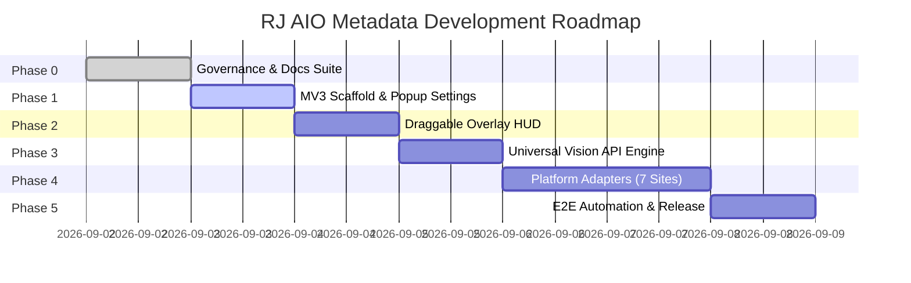

# Project Roadmap — RJ AIO Metadata Extension

---

## Milestone Overview

---

## Phase Breakdown

### Phase 0: Project Governance, Documentation Suite & Scaffolding `[CURRENT]`
- [x] Reverse-engineer and document 7 microstock platforms in `docs/references/`.
- [x] Create root governance files: `AGENTS.md`, `DESIGN.md` (Raycast Design System), `README.md`, `CHANGELOG.md`.
- [x] Create complete documentation suite: `docs/DOCS_STYLE.md`, `docs/ARCHITECTURE.md`, `docs/CURRENT_STATE.md`, `docs/DECISIONS.md`, `docs/GIT_POLICY.md`, `docs/HANDOFF.md`, `docs/ROADMAP.md`.
- [x] Initialize Git repository with `main`, `dev`, and `task/phase0-governance-docs` branches.
- [x] Scaffold Manifest V3 source directory structure in `src/`.

---

### Phase 1: Manifest V3 Scaffold, Storage Service & Popup Settings UI
- [ ] Implement `src/manifest.json` with declarative permissions (`storage`, `activeTab`, `scripting`).
- [ ] Implement `src/services/StorageService.js` for API keys, custom `baseUrl`, model presets, and user preferences.
- [ ] Build Toolbar Popup UI (`src/popup/popup.html`, `popup.css`, `popup.js`):
  - API provider preset selector + custom endpoint configuration.
  - API Key visibility toggles and credential tester.
  - Active platform detection badge.
  - Shortcut button to launch/focus In-Page Overlay.

---

### Phase 2: In-Page Draggable Floating Overlay HUD (Raycast Design System)
- [ ] Build Draggable & Minimizable In-Page HUD (`src/overlay/`):
  - Glassmorphism backdrop blur and Raycast Dark Precision styling (`#07080a`, hairline `#242728`).
  - Drag-and-drop header handler.
  - Minimize toggle (`─`) reducing HUD to a compact floating pill.
  - Batch action toolbar: "Auto-Tag All", "Save All Drafts", "Clear Metadata".
  - Detected assets counter and progress bar.
  - Metadata drawer for manual review/editing before injection.

---

### Phase 3: Universal OpenAI-Compatible Vision AI Service & Prompt Engine
- [ ] Implement `src/services/AiVisionService.js`:
  - Standard OpenAI `POST /v1/chat/completions` client with multimodal base64 image support.
  - Provider presets: Gemini, Groq, Mistral, OpenAI, OpenRouter, and Custom Endpoint.
  - Automatic rate-limiting and retry handler with exponential backoff.
- [ ] Implement `src/services/PromptBuilder.js`:
  - Structured prompt engineering optimized for microstock SEO (Commercial vs Editorial title, top 30-50 high-converting keywords, category mapping).
- [ ] Implement `src/services/SanitizerService.js`:
  - Prohibited terms filtering, symbol stripping, and platform-specific sanitization.

---

### Phase 4: Platform Adapters Implementation (7 Platforms)
- [ ] Create `src/adapters/BaseAdapter.js` abstract interface.
- [ ] **Tier 1 Adapters**:
  - `AdobeStockAdapter.js` (React Spectrum value setter, 21 categories).
  - `ShutterstockAdapter.js` (Material-UI selectors, Image vs Video categories, spelling warnings auto-approval).
  - `FreepikAdapter.js` (Mandatory save draft loop per asset, AI base models).
- [ ] **Tier 2 Adapters**:
  - `VecteezyAdapter.js` (Automatic filetype category, prohibited terms handling, AI 'Other' model input).
  - `DreamstimeAdapter.js` (15 Main / 182 Subcategories tree, Mode A vs Mode B loop).
  - `DepositphotosAdapter.js` (160 items/page paginator, raw tag paste trigger, editorial country/city AJAX).
  - `MiriCanvasAdapter.js` (1,000 items/page batching, ContentType & Tier radios).
- [ ] Implement `src/adapters/index.js` adapter registry & auto-router.

---

### Phase 5: End-to-End Batch Automation, Auto-Save, and Release
- [ ] End-to-end integration testing across all 7 contributor platforms.
- [ ] Batch automation orchestrator: Sequential asset processing with customizable delay intervals.
- [ ] Package extension release and final documentation wrap-up.
