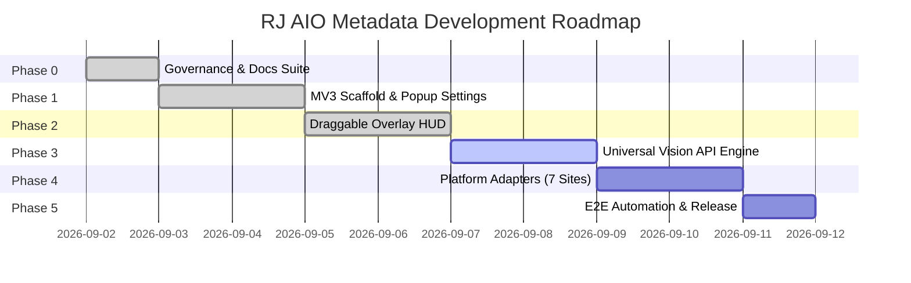

# Project Roadmap — RJ AIO Metadata Extension

---

## Milestone Overview

---

## Phase Breakdown

### Phase 0: Project Governance, Documentation Suite & Scaffolding `[COMPLETE]`
- [x] Reverse-engineer and document 7 microstock platforms in `docs/references/`.
- [x] Create root governance files: `AGENTS.md`, `DESIGN.md` (Raycast Design System), `README.md`, `CHANGELOG.md`.
- [x] Create complete documentation suite: `docs/DOCS_STYLE.md`, `docs/ARCHITECTURE.md`, `docs/CURRENT_STATE.md`, `docs/DECISIONS.md`, `docs/GIT_POLICY.md`, `docs/HANDOFF.md`, `docs/ROADMAP.md`.
- [x] Initialize Git repository with `main`, `dev`, and `task/phase0-governance-docs` branches.
- [x] Scaffold Manifest V3 source directory structure in `src/`.

---

### Phase 1: Manifest V3 Scaffold, Storage Service & Popup Settings UI `[COMPLETE]`
- [x] Implement `src/manifest.json` with permissions (`storage`, `activeTab`, `scripting`), universal content script matches, and icons (`src/icons/`).
- [x] Implement `src/services/StorageService.js` for API keys, custom `baseUrl`, model presets, keyword prioritization, schema versioning (v3), and `.txt` file reader.
- [x] Implement `src/background/service_worker.js` with dynamic model fetcher (`/v1/models`), Google Gemini query auth, active tab routing, and overlay toggle relay.
- [x] Build Platform-Adaptive Toolbar Popup UI (`src/popup/popup.html`, `popup.css`, `popup.js`, `src/styles/components.css`):
  - Active platform selector with real-time match indicator (Green check vs Red mismatch + navigation helper link).
  - API provider configuration (Gemini, Groq, Mistral, OpenAI, OpenRouter, Custom) + API Key password toggle & `.txt` file import.
  - Model dropdown + dynamic model fetching with refresh rotation animation and active model selection guard.
  - Universal settings: Keyword count stepper with platform limit boundaries + Specific custom keywords (index 0 priority).
  - 100% modular platform-dynamic settings for Adobe Stock, Shutterstock, Dreamstime, Vecteezy, Freepik, Depositphotos (with 237 countries catalog), MiriCanvas.
  - Processing safety: automatic field locking during active automation.
  - Interactive toolbar header with in-place HUD toggle button featuring cyan hairline outline active state.
  - Top-right 3-item FIFO stacked toast notification system with 2-line text clamping, manual close button, and smooth slide-out reflow.

---

### Phase 2: In-Page Draggable Floating Overlay HUD (Raycast Design System) `[COMPLETE]`
- [x] Build Draggable & Minimizable In-Page HUD (`src/overlay/overlay.js`, `overlay.css`, `src/content/content_main.js`):
  - Isolated Shadow DOM host (`#rj-overlay-host` open mode) linking scoped stylesheet `overlay.css` ensuring zero host CSS bleed.
  - Fluid drag-and-drop header handler with strict viewport boundary clamping and coordinates persistence in `chrome.storage.local`.
  - Dual-mode display: 270px Expanded HUD Card and 32px Minimized Floating Pill with spring transition animations (`cubic-bezier(0.16, 1, 0.3, 1)`).
  - Adaptive Quick Form:
    - Target keyword stepper with platform limit clamping (Adobe: 49, Dreamstime: 70, MiriCanvas: 25, others: 50).
    - Specific keywords input (Index 0 priority) with debounced storage persistence.
    - Platform-adaptive AI / Generative Declaration toggle (automatically hidden on Shutterstock & Depositphotos).
  - Live Multi-Platform Asset Counter & Progress Track:
    - Periodic (2.5s) and `MutationObserver` reactive DOM asset querying across all 7 platforms.
    - Depositphotos subtab media category detection (`Images`, `Vectors`, `PNG`, `Videos`, `Audio`).
    - Shutterstock subtab media category detection (`Images` vs `Videos` with accurate button count parsing).
    - Dreamstime single-asset ID edit mode detection (`In ID 473814624`).
  - Context-Aware Status Icons on Minimized Pill:
    - Layers icon (`.rj-status-icon-layers`) when assets are detected (`35 Assets`, `ID: 473814624`).
    - Checkmark icon (`.rj-status-icon-ready`) when verified on supported microstock page with 0 assets.
    - Alert warning icon (`#f59e0b`) on unsupported pages.
  - Non-microstock tab safety: Warning banner ("Not a supported microstock page"), "Unknown Page" header tag, and "Assets Not Detected" label with automation disabled.
  - Primary Automation Action Button (Start/Stop) styled in deep emerald teal (`#079183`) / danger red (`#ff6161`) with model selection guard.
  - Bidirectional real-time state synchronization via `chrome.storage.onChanged` between in-page HUD and popup UI.

---

### Phase 3: Universal OpenAI-Compatible Vision AI Service & Prompt Engine `[NEXT]`
- [ ] Implement `src/services/AiVisionService.js`:
  - Standard OpenAI `POST /v1/chat/completions` client with multimodal base64 image support.
  - Provider presets: Gemini, Groq, Mistral, OpenAI, OpenRouter, and Custom Endpoint.
  - Automatic rate-limiting and retry handler with exponential backoff.
- [ ] Implement `src/services/PromptBuilder.js`:
  - Structured prompt engineering optimized for microstock SEO (Commercial vs Editorial title, top 30-50 high-converting keywords, category mapping).
- [ ] Implement `src/services/SanitizerService.js`:
  - Prohibited terms filtering, symbol stripping, and platform-specific sanitization.

---

### Phase 4: Platform Adapters Implementation (7 Platforms)
- [ ] Create `src/adapters/BaseAdapter.js` abstract interface.
- [ ] **Tier 1 Adapters**:
  - `AdobeStockAdapter.js` (React Spectrum value setter, 21 categories).
  - `ShutterstockAdapter.js` (Material-UI selectors, Image vs Video categories, spelling warnings auto-approval).
  - `FreepikAdapter.js` (Mandatory save draft loop per asset, AI base models).
- [ ] **Tier 2 Adapters**:
  - `VecteezyAdapter.js` (Automatic filetype category, prohibited terms handling, AI 'Other' model input).
  - `DreamstimeAdapter.js` (15 Main / 182 Subcategories tree, Mode A vs Mode B loop).
  - `DepositphotosAdapter.js` (160 items/page paginator, raw tag paste trigger, editorial country/city AJAX).
  - `MiriCanvasAdapter.js` (1,000 items/page batching, ContentType & Tier radios).
- [ ] Implement `src/adapters/index.js` adapter registry & auto-router.

---

### Phase 5: End-to-End Batch Automation, Auto-Save, and Release
- [ ] End-to-end integration testing across all 7 contributor platforms.
- [ ] Batch automation orchestrator: Sequential asset processing with customizable delay intervals.
- [ ] Package extension release and final documentation wrap-up.
